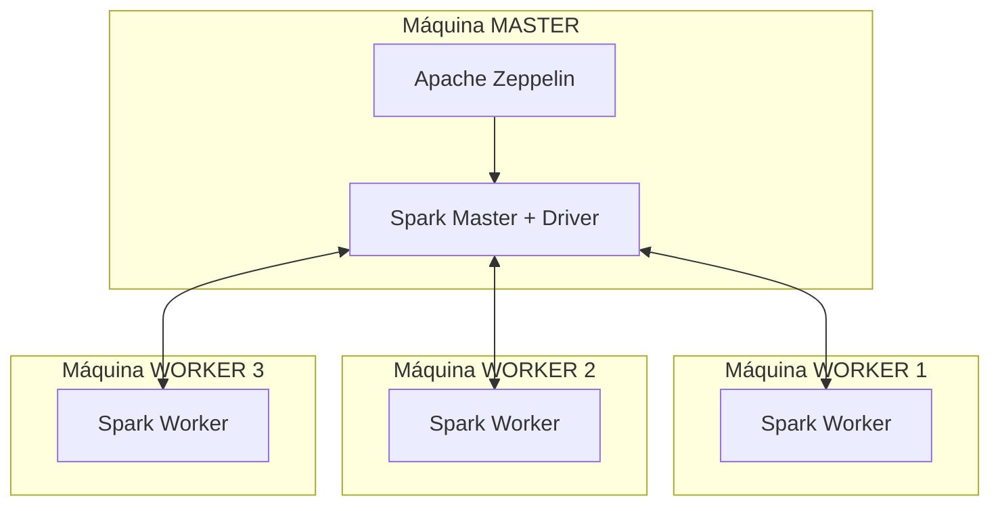
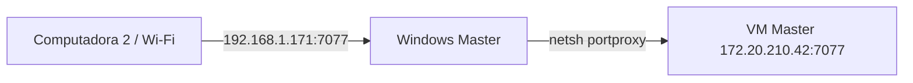

# ProyectoGrupal-apache_zeppelin_distribuido
Integrantes: Jhordy Camacas, Diego Loján, Jesús Rivas y Santiago Matute

# Informe de Instalación — Cluster Spark Distribuido con Multipass y Zeppelin

# Informe de Instalación — Cluster Spark Distribuido con Multipass y Zeppelin

**Proyecto:** Análisis Exploratorio de Datos (EDA) distribuido sobre un archivo CSV de gran tamaño
**Arquitectura:** 1 máquina Master + 3 máquinas Worker (4 computadoras en total), cada una con una VM Ubuntu en Multipass

---

## 1. Objetivo del proyecto

El objetivo de este proyecto es procesar un archivo CSV de gran volumen (5 GB) de forma **distribuida**, utilizando Apache Spark en modo *Standalone Cluster*. Para esto se emplean 4 computadoras físicas distintas, cada una con su propia máquina virtual Ubuntu creada con **Multipass**.

En vez de que una sola máquina procese todo el archivo, el trabajo se reparte entre los **executors** de las 4 VMs, aprovechando el paralelismo real de Spark.

---

## 2. Arquitectura general

El cluster está compuesto por dos roles claramente diferenciados:

| Rol | Cantidad | Software instalado | Función |
|---|---|---|---|
| **Master** | 1 máquina | Java + Apache Spark + Apache Zeppelin | Coordina el cluster y ejecuta el notebook (driver) |
| **Worker** | 3 máquinas | Java + Apache Spark (solo) | Ejecutan las tareas reales de procesamiento (executors) |

> **Punto clave del diseño:** Únicamente la máquina Master necesita tener instalado **Apache Zeppelin**. Las máquinas Worker **no necesitan Zeppelin en absoluto** — su única función es correr el proceso `Worker` de Spark y esperar a que el Master les asigne tareas. Los workers se conectan al `SparkContext` que vive en el Master, y desde ahí reciben el trabajo a ejecutar.



*(Aquí puedes insertar tu captura del diagrama de arquitectura o de las 4 VMs abiertas en Multipass)*

---

## 3. Requisitos previos (en las 4 computadoras)

- Sistema operativo Windows con **Multipass** instalado (usando Hyper-V como hipervisor).
- Conexión de red entre las 4 computadoras físicas (misma red LAN).
- Recursos recomendados por VM: 4 CPUs, 4-8 GB de RAM, 40 GB de disco.

Verificación de Multipass en cada equipo:

```powershell
multipass version
```

---

## 4. Creación de la máquina virtual (en las 4 computadoras)

En cada una de las 4 computadoras se crea una VM Ubuntu 24.04:

```bash
multipass launch 24.04 \
  --name spark-lab \
  --cpus 4 \
  --memory 4G \
  --disk 40G
```

Verificar que la instancia quedó creada:

```bash
multipass list
```

*(Aquí puedes insertar la captura de `multipass list` mostrando las 4 VMs)*

Entrar a la VM:

```bash
multipass shell spark-lab
```

---

## 5. Instalación base común (Java + herramientas) — en las 4 máquinas

Independientemente del rol (Master o Worker), **todas** las VMs necesitan Java y Spark. Este paso se repite igual en las 4.

```bash
sudo apt update
sudo apt upgrade -y
sudo apt install -y wget curl tar nano unzip net-tools openssh-client openssh-server openjdk-17-jdk
```

Verificar Java:

```bash
java -version
```

Configurar `JAVA_HOME` en `~/.bashrc`:

```bash
export JAVA_HOME=/usr/lib/jvm/java-17-openjdk-amd64
export PATH=$JAVA_HOME/bin:$PATH
```

Aplicar cambios:

```bash
source ~/.bashrc
```

---

## 6. Instalación de Apache Spark — en las 4 máquinas

Este paso también es idéntico en Master y Workers, ya que todos necesitan el binario de Spark para poder ejecutar el proceso correspondiente (`Master` en una, `Worker` en las otras dos).

```bash
mkdir -p ~/software
cd ~/software
wget https://downloads.apache.org/spark/spark-4.1.2/spark-4.1.2-bin-hadoop3.tgz
tar -xzf spark-4.1.2-bin-hadoop3.tgz
sudo mv spark-4.1.2-bin-hadoop3 /opt/spark
```

Configurar variables de entorno en `~/.bashrc`:

```bash
export SPARK_HOME=/opt/spark
export PATH=$SPARK_HOME/bin:$SPARK_HOME/sbin:$PATH
```

Aplicar y verificar:

```bash
source ~/.bashrc
spark-shell --version
```

*(Aquí puedes insertar la captura del `spark-shell --version` corriendo en cada máquina)*

---

## 7. Configuración de red — en las 4 máquinas

Para que las 4 VMs puedan verse entre sí de forma estable, cada una debe anunciar su propia IP real dentro de la red compartida (no `localhost`).

Obtener la IP de cada VM:

```bash
ip addr show eth0
```

Editar la configuración de Spark en **cada** máquina:

```bash
nano $SPARK_HOME/conf/spark-env.sh
```

Agregar (usando la IP real de esa VM específica):

```bash
export SPARK_LOCAL_IP=<IP_DE_ESTA_VM>
```

En la máquina **Master** además se agrega:

```bash
export SPARK_MASTER_HOST=<IP_DEL_MASTER>
```

---

## 8. Levantar el proceso Master — solo en la máquina Master

```bash
$SPARK_HOME/sbin/start-master.sh --webui-port 8081
```

Verificar que el proceso quedó activo:

```bash
jps
```

Debe aparecer `Master` en la lista.

Obtener la URL del master (se necesita en el siguiente paso):

```text
spark://<IP_DEL_MASTER>:7077
```

*(Aquí puedes insertar la captura de la Spark Master UI mostrando "Status: ALIVE")*

---

## 9. Levantar el proceso Worker — solo en las 3 máquinas Worker

En **cada** VM Worker, apuntando a la IP del Master:

```bash
$SPARK_HOME/sbin/start-worker.sh spark://<IP_DEL_MASTER>:7077
```

Verificar:

```bash
jps
```

Debe aparecer `Worker` en la lista.

---

## 10. Verificación del cluster completo

Desde el navegador de cualquiera de las 4 computadoras:

```text
http://<IP_DEL_MASTER>:8081
```

En la tabla **Workers** deben aparecer los 3 workers en estado **ALIVE**, con sus cores y memoria disponibles.

*(Aquí puedes insertar la captura de la Spark Master UI mostrando los 3 workers ALIVE)*

---

## 11. Instalación de Apache Zeppelin — SOLO en la máquina Master

Este es el paso que diferencia a la máquina Master del resto: **solo aquí se instala Zeppelin**, ya que es el notebook desde donde se escribe y ejecuta el código que se distribuye hacia los workers.

```bash
cd ~/software
wget https://downloads.apache.org/zeppelin/zeppelin-0.12.1/zeppelin-0.12.1-bin-all.tgz
tar -xzf zeppelin-0.12.1-bin-all.tgz
sudo mv zeppelin-0.12.1-bin-all /opt/zeppelin
```

Configurar variables de entorno:

```bash
export ZEPPELIN_HOME=/opt/zeppelin
export PATH=$ZEPPELIN_HOME/bin:$PATH
```

---

## 12. Configuración de Zeppelin para conectarse al cluster — solo en el Master

```bash
cd $ZEPPELIN_HOME/conf
cp zeppelin-env.sh.template zeppelin-env.sh
cp zeppelin-site.xml.template zeppelin-site.xml
nano zeppelin-env.sh
```

Configurar:

```bash
export JAVA_HOME=/usr/lib/jvm/java-17-openjdk-amd64
export SPARK_HOME=/opt/spark
export MASTER=spark://<IP_DEL_MASTER>:7077
```

En `zeppelin-site.xml`, habilitar que el servidor escuche en todas las interfaces:

```xml
<property>
  <n>zeppelin.server.addr</n>
  <value>0.0.0.0</value>
</property>
```

---

## 13. Iniciar Zeppelin — solo en el Master

```bash
$ZEPPELIN_HOME/bin/zeppelin-daemon.sh start
```

Verificar proceso:

```bash
jps
```

Acceder desde el navegador de cualquier computadora:

```text
http://<IP_DEL_MASTER>:8080
```

*(Aquí puedes insertar la captura de la interfaz web de Zeppelin ya abierta)*

---

## 14. Prueba final del cluster distribuido

Desde un notebook nuevo en Zeppelin, ejecutar:

```scala
%spark
val datos = spark.range(1000000)
printf("Total: %d%n", datos.count())
```

Si el resultado se calcula correctamente y, al revisar la Spark Application UI (`http://<IP_DEL_MASTER>:4040`), se observan tareas ejecutándose en paralelo en ambos workers, el cluster distribuido está funcionando correctamente.

*(Aquí puedes insertar la captura de la Spark UI mostrando tareas corriendo en ambos workers)*

---

## 15. Resumen de responsabilidades por máquina

| Componente | Máquina Master | Máquina Worker 1 | Máquina Worker 2 | Máquina Worker 3 |
|---|---|---|---|---|
| Java | ✅ | ✅ | ✅ | ✅ |
| Apache Spark | ✅ | ✅ | ✅ | ✅ |
| Apache Zeppelin | ✅ (única instalación) | ❌ | ❌ | ❌ |
| Proceso `Master` | ✅ | ❌ | ❌ | ❌ |
| Proceso `Worker` | ❌ (opcional) | ✅ | ✅ | ✅ |

---

## 16. Anexo: Configuración real de red utilizada (Wi-Fi + Redirección de puertos)

Esta sección documenta cómo se resolvió la conexión real entre las 4 computadoras en la práctica, incluyendo los problemas encontrados durante la implementación y cómo se solucionaron. Se incluye porque el comportamiento real difiere del escenario ideal (red cableada/VPN dedicada) y es importante dejarlo registrado para el sustento del proyecto.

### 16.1. Contexto de la red usada

Las 4 computadoras se conectaron a través de la **red Wi-Fi doméstica** (`192.168.1.x`), no mediante cable de red ni una VPN dedicada. Esto tiene una consecuencia importante:

> **El uso de Wi-Fi en vez de una conexión cableada introduce mayor latencia, jitter (variación de latencia) y, ocasionalmente, pérdida de paquetes.** Esto se reflejó directamente en el cluster: en las pruebas se observaron workers que pasaban de `ALIVE` a `DEAD` de forma intermitente, tareas que tardaban mucho más de lo esperado, y ejecuciones que parecían "colgarse" sin motivo aparente.

*(Aquí puedes insertar la captura del `ipconfig` mostrando la IP de Wi-Fi, 192.168.1.171)*

### 16.2. El problema de fondo: doble capa de red

Cada VM de Multipass vive dentro de una red interna de Hyper-V (por ejemplo `172.20.210.42`), que **no es directamente alcanzable** desde las otras computadoras de la red Wi-Fi — solo la computadora que la contiene puede verla directamente. Para que las otras 3 máquinas pudieran llegar a los servicios de Spark (Master, Worker, Driver, UIs), fue necesario **redirigir puertos** desde la IP de Windows (visible en la red Wi-Fi) hacia la IP interna de la VM.



### 16.3. Puertos redirigidos en la máquina Master (Windows, PowerShell como Administrador)

```powershell
netsh interface portproxy add v4tov4 listenaddress=0.0.0.0 listenport=7077 connectaddress=172.20.210.42 connectport=7077
netsh interface portproxy add v4tov4 listenaddress=0.0.0.0 listenport=8081 connectaddress=172.20.210.42 connectport=8081
netsh interface portproxy add v4tov4 listenaddress=0.0.0.0 listenport=4040 connectaddress=172.20.210.42 connectport=4040
netsh interface portproxy add v4tov4 listenaddress=0.0.0.0 listenport=8080 connectaddress=172.20.210.42 connectport=8080
netsh interface portproxy add v4tov4 listenaddress=0.0.0.0 listenport=42000 connectaddress=172.20.210.42 connectport=42000
netsh interface portproxy add v4tov4 listenaddress=0.0.0.0 listenport=42001 connectaddress=172.20.210.42 connectport=42001
```

Y las reglas de firewall correspondientes para permitir el tráfico entrante:

```powershell
netsh advfirewall firewall add rule name="SparkMaster" dir=in action=allow protocol=TCP localport=7077,8081,4040
netsh advfirewall firewall add rule name="ZeppelinUI" dir=in action=allow protocol=TCP localport=8080
netsh advfirewall firewall add rule name="SparkDriver" dir=in action=allow protocol=TCP localport=42000,42001
```

*(Aquí puedes insertar la captura de PowerShell mostrando estas reglas aplicadas y el `netsh interface portproxy show v4tov4`)*

### 16.4. Puertos redirigidos en cada máquina Worker

De forma equivalente, en cada computadora Worker se redirigieron los puertos propios del proceso `Worker`:

```powershell
netsh interface portproxy add v4tov4 listenaddress=0.0.0.0 listenport=7078 connectaddress=<IP_VM_WORKER> connectport=7078
netsh interface portproxy add v4tov4 listenaddress=0.0.0.0 listenport=8082 connectaddress=<IP_VM_WORKER> connectport=8082
netsh advfirewall firewall add rule name="SparkWorker" dir=in action=allow protocol=TCP localport=7078,8082
```

*(Aquí puedes insertar la captura de esto ejecutado en un worker)*

### 16.5. Configurar el Driver para anunciar la IP correcta

Como Zeppelin (el driver) corre dentro de la VM Master, pero necesita ser alcanzado desde las otras 3 computadoras por Wi-Fi, se configuró explícitamente en el intérprete de Spark (Zeppelin → Interpreter → spark):

| Propiedad | Valor |
|---|---|
| `spark.driver.host` | IP de Windows del Master (ej. `192.168.1.171`) |
| `spark.driver.bindAddress` | IP interna de la VM Master (ej. `172.20.210.42`) |
| `spark.driver.port` | `42000` |
| `spark.blockManager.port` | `42001` |

*(Aquí puedes insertar la captura de esta configuración en el intérprete de Zeppelin)*

> **Por qué dos IPs distintas:** `bindAddress` es la interfaz en la que el proceso realmente escucha (la de la VM), mientras que `host` es la dirección que se le comunica a los workers para que sepan a dónde responder (la de Windows, que sí es visible en la red Wi-Fi). Sin este ajuste, los workers no podían encontrar al driver y las tareas se quedaban colgadas indefinidamente.

### 16.6. Problemas encontrados durante las pruebas y su solución

| Problema observado | Causa | Solución aplicada |
|---|---|---|
| Un worker aparecía como **DEAD** en la Master UI de forma intermitente | Inestabilidad propia del Wi-Fi (latencia variable, microcortes) sumada a timeouts por defecto de Spark, muy cortos para este tipo de red | Se aumentaron los timeouts: `spark.network.timeout=300s`, `spark.executor.heartbeatInterval=60s`, `spark.worker.timeout=180`, `spark.rpc.askTimeout=300s`, `spark.rpc.lookupTimeout=300s` |
| Un executor cargaba mucho más trabajo que los otros (ej. 4/4 cores usados en un worker mientras otro solo usaba 2/4) | Los recursos de Spark (`executor.cores`, `executor.memory`) nunca se configuraron explícitamente, por lo que el reparto no era uniforme | Se fijaron `spark.executor.cores` y `spark.executor.memory` de forma explícita en el intérprete, en función de los recursos reales de cada VM |
| Un stage se quedaba "congelado" en la Spark UI (ej. 0/43 tareas pendientes, 1 tarea corriendo sin avanzar) | El driver anunciaba una IP no alcanzable por los workers (la interna de la VM en vez de la de Windows) | Se configuró `spark.driver.host` con la IP de Windows y se agregaron las reglas de `portproxy` |
| Lectura del CSV de 5 GB muy lenta o inconsistente entre ejecuciones | Doble escaneo del archivo por `inferSchema=true`, agravado por la latencia de Wi-Fi | Se reemplazó `inferSchema` por un `StructType` con el schema definido manualmente |

*(Aquí puedes insertar la captura de la Master UI mostrando un worker en estado DEAD, y luego la captura donde ya aparece ALIVE tras aplicar la solución)*

### 16.7. Limitación reconocida del proyecto

Se documenta como limitación conocida que, al usar **Wi-Fi en vez de una red cableada**, el rendimiento del cluster es notablemente menor al que se obtendría con Ethernet o una VPN de baja latencia (como ZeroTier o Tailscale). Esto se refleja en tiempos de lectura más variables y en la necesidad de aumentar los timeouts de Spark para tolerar la inestabilidad de la red inalámbrica.

---

## 17. Anexo: Decisión de reducir el dataset de 5 GB a 2 GB para el EDA

Durante la fase de Análisis Exploratorio de Datos (EDA) se tomó la decisión de **reducir el tamaño del archivo de trabajo de 5 GB a 2 GB**. Esta sección documenta el motivo de este cambio.

### 17.1. Motivo del cambio

Aunque el cluster ya lograba conectar correctamente sus 4 nodos (1 Master + 3 Workers) y ejecutar lecturas del CSV completo, el procesamiento de los **5 GB** resultaba **demasiado pesado para los recursos reales disponibles**, considerando en conjunto:

- Los recursos limitados de cada VM (CPU y memoria repartidos entre 4 máquinas domésticas, no servidores dedicados).
- La latencia y variabilidad de la red **Wi-Fi** utilizada para conectar las 4 computadoras (documentada en la sección 16), que ralentiza cualquier operación que requiera comunicación entre nodos (shuffles, agregaciones, consolidación de resultados).
- Que el objetivo del proyecto es el **EDA** (análisis exploratorio: estadísticas descriptivas, nulos, distribuciones, correlaciones), un tipo de trabajo que no requiere el dataset completo para obtener conclusiones representativas — un subconjunto de 2 GB es suficiente para extraer patrones y características del dataset sin comprometer la validez del análisis.

En otras palabras: **5 GB era técnicamente procesable, pero no práctico** para el hardware y la red disponibles en este laboratorio, generando tiempos de espera excesivos y mayor probabilidad de que algún worker se cayera por timeout durante operaciones largas.

### 17.2. Cómo se generó el archivo reducido

A partir del archivo original de 5 GB, se generó un subconjunto de aproximadamente 2 GB manteniendo la estructura y representatividad de los datos. Por ejemplo, tomando un porcentaje de las filas originales:

```scala
val dfCompleto = spark.read
  .option("header", "true")
  .schema(schema)
  .csv("/data/2019-Oct.csv")

// Se conserva una fracción representativa del dataset original (~40%, ajustable
// según el tamaño final deseado), usando una semilla fija para reproducibilidad
val dfReducido = dfCompleto.sample(withReplacement = false, fraction = 0.4, seed = 42)

dfReducido.write
  .option("header", "true")
  .mode("overwrite")
  .csv("/data/2019-Oct-reducido")
```

*(Aquí puedes insertar la captura del comando ejecutándose y del tamaño final del archivo, por ejemplo con `du -sh /data/2019-Oct-reducido`)*

### 17.3. Resultado de la reducción

| | Archivo original | Archivo usado para el EDA |
|---|---|---|
| Tamaño | ~5 GB | ~2 GB |
| Filas | Dataset completo | Muestra representativa |
| Tiempo de lectura + procesamiento | Alto, con riesgo de timeouts en Wi-Fi | Notablemente menor y más estable |
| Validez para el EDA | — | Suficiente para estadísticas descriptivas y distribuciones representativas |

*(Aquí puedes insertar la captura de la Spark UI comparando los tiempos de ejecución con el archivo de 2 GB, mostrando las tareas completándose sin quedarse colgadas)*

### 17.4. Justificación académica

Reducir el volumen de datos para el EDA es una práctica común y válida cuando el objetivo es entender la estructura, calidad y distribución de los datos, y no calcular un resultado exacto y exhaustivo sobre el 100% del dataset (como sí sería necesario, por ejemplo, para un reporte financiero final o un modelo de producción). Esta decisión permitió avanzar con el análisis dentro de las limitaciones reales de infraestructura del laboratorio, sin invalidar los hallazgos del EDA.

---

## 18. Conclusión

Con esta arquitectura, el procesamiento del CSV se reparte entre los executors de las 4 máquinas físicas, en vez de depender de una sola computadora. Solo la máquina Master necesita el notebook de Zeppelin, ya que actúa como punto único de entrada (driver) para todo el cluster; las máquinas Worker únicamente requieren Spark instalado para poder recibir y ejecutar las tareas asignadas. Además, ante las limitaciones reales de hardware y de red (Wi-Fi) del laboratorio, se ajustó el volumen de datos de 5 GB a 2 GB para garantizar que el EDA pudiera completarse de forma estable y en tiempos razonables., el procesamiento del CSV de 5 GB se reparte entre los executors de las 4 máquinas físicas, en vez de depender de una sola computadora. Solo la máquina Master necesita el notebook de Zeppelin, ya que actúa como punto único de entrada (driver) para todo el cluster; las máquinas Worker únicamente requieren Spark instalado para poder recibir y ejecutar las tareas asignadas.
