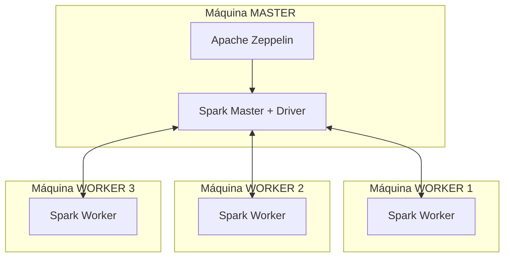
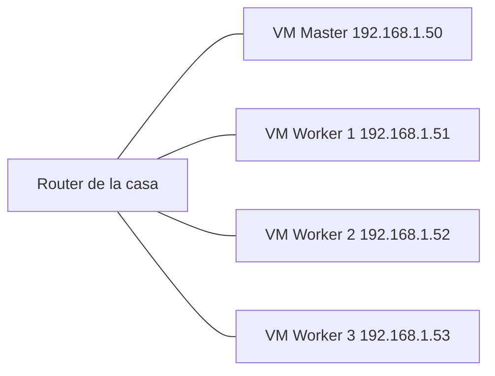

# ProyectoGrupal-apache_zeppelin_distribuido
Integrantes: Jhordy Camacas, Diego Loján, Jesús Rivas y Santiago Matute

# Informe de Instalación — Cluster Spark Distribuido con Multipass y Zeppelin

**Proyecto:** Análisis Exploratorio de Datos (EDA) distribuido sobre un archivo CSV de gran tamaño
**Arquitectura:** 1 máquina Master + 3 máquinas Worker (4 computadoras en total), cada una con una VM Ubuntu en Multipass

---

## 1. Objetivo del proyecto

El objetivo de este proyecto es procesar un archivo CSV de gran volumen (5 GB) de forma **distribuida**, utilizando Apache Spark en modo *Standalone Cluster*. Para esto se emplean 4 computadoras físicas distintas, cada una con su propia máquina virtual Ubuntu creada con **Multipass**.

En vez de que una sola máquina procese todo el archivo, el trabajo se reparte entre los **executors** de las 4 VMs, aprovechando el paralelismo real de Spark.

---

## 2. Arquitectura general

El cluster está compuesto por dos roles claramente diferenciados:

| Rol | Cantidad | Software instalado | Función |
|---|---|---|---|
| **Master** | 1 máquina | Java + Apache Spark + Apache Zeppelin | Coordina el cluster y ejecuta el notebook (driver) |
| **Worker** | 3 máquinas | Java + Apache Spark (solo) | Ejecutan las tareas reales de procesamiento (executors) |

> **Punto clave del diseño:** Únicamente la máquina Master necesita tener instalado **Apache Zeppelin**. Las máquinas Worker **no necesitan Zeppelin en absoluto** — su única función es correr el proceso `Worker` de Spark y esperar a que el Master les asigne tareas. Los workers se conectan al `SparkContext` que vive en el Master, y desde ahí reciben el trabajo a ejecutar.



*(Aquí puedes insertar tu captura del diagrama de arquitectura o de las 4 VMs abiertas en Multipass)*

---

## 3. Requisitos previos (en las 4 computadoras)

- Sistema operativo Windows con **Multipass** instalado (usando Hyper-V como hipervisor).
- Conexión de red entre las 4 computadoras físicas (misma red LAN).
- Recursos recomendados por VM: 4 CPUs, 4-8 GB de RAM, 40 GB de disco.

Verificación de Multipass en cada equipo:

```powershell
multipass version
```

---

## 4. Creación de la máquina virtual (en las 4 computadoras)

En cada una de las 4 computadoras se crea una VM Ubuntu 24.04:

```bash
multipass launch 24.04 \
  --name spark-lab \
  --cpus 4 \
  --memory 4G \
  --disk 40G
```

Verificar que la instancia quedó creada:

```bash
multipass list
```

*(Aquí puedes insertar la captura de `multipass list` mostrando las 4 VMs)*

Entrar a la VM:

```bash
multipass shell spark-lab
```

---

## 5. Instalación base común (Java + herramientas) — en las 4 máquinas

Independientemente del rol (Master o Worker), **todas** las VMs necesitan Java y Spark. Este paso se repite igual en las 4.

```bash
sudo apt update
sudo apt upgrade -y
sudo apt install -y wget curl tar nano unzip net-tools openssh-client openssh-server openjdk-17-jdk
```

Verificar Java:

```bash
java -version
```

Configurar `JAVA_HOME` en `~/.bashrc`:

```bash
export JAVA_HOME=/usr/lib/jvm/java-17-openjdk-amd64
export PATH=$JAVA_HOME/bin:$PATH
```

Aplicar cambios:

```bash
source ~/.bashrc
```

---

## 6. Instalación de Apache Spark — en las 4 máquinas

Este paso también es idéntico en Master y Workers, ya que todos necesitan el binario de Spark para poder ejecutar el proceso correspondiente (`Master` en una, `Worker` en las otras dos).

```bash
mkdir -p ~/software
cd ~/software
wget https://downloads.apache.org/spark/spark-4.1.2/spark-4.1.2-bin-hadoop3.tgz
tar -xzf spark-4.1.2-bin-hadoop3.tgz
sudo mv spark-4.1.2-bin-hadoop3 /opt/spark
```

Configurar variables de entorno en `~/.bashrc`:

```bash
export SPARK_HOME=/opt/spark
export PATH=$SPARK_HOME/bin:$SPARK_HOME/sbin:$PATH
```

Aplicar y verificar:

```bash
source ~/.bashrc
spark-shell --version
```

*(Aquí puedes insertar la captura del `spark-shell --version` corriendo en cada máquina)*

---

## 7. Configuración de red — en las 4 máquinas

Para que las 4 VMs puedan verse entre sí de forma estable, cada una debe anunciar su propia IP real dentro de la red compartida (no `localhost`).

> **Nota:** en este proyecto, la IP real de cada VM se obtuvo mediante una interfaz de red en modo **bridged** (puente directo a la red Wi-Fi de la casa), en vez de la interfaz NAT por defecto de Multipass. El detalle completo de cómo se configuró (creación de la VM con `--network`, netplan, interfaz `extra0`) está documentado en la **sección 16**. Aquí se resume el paso general:

Obtener la IP de cada VM:

```bash
ip addr show extra0
```

Editar la configuración de Spark en **cada** máquina:

```bash
nano $SPARK_HOME/conf/spark-env.sh
```

Agregar (usando la IP real de esa VM específica):

```bash
export SPARK_LOCAL_IP=<IP_DE_ESTA_VM>
```

En la máquina **Master** además se agrega:

```bash
export SPARK_MASTER_HOST=<IP_DEL_MASTER>
```

---

## 8. Levantar el proceso Master — solo en la máquina Master

```bash
$SPARK_HOME/sbin/start-master.sh --webui-port 8081
```

Verificar que el proceso quedó activo:

```bash
jps
```

Debe aparecer `Master` en la lista.

Obtener la URL del master (se necesita en el siguiente paso):

```text
spark://<IP_DEL_MASTER>:7077
```

*(Aquí puedes insertar la captura de la Spark Master UI mostrando "Status: ALIVE")*

---

## 9. Levantar el proceso Worker — solo en las 3 máquinas Worker

En **cada** VM Worker, apuntando a la IP del Master:

```bash
$SPARK_HOME/sbin/start-worker.sh spark://<IP_DEL_MASTER>:7077
```

Verificar:

```bash
jps
```

Debe aparecer `Worker` en la lista.

---

## 10. Verificación del cluster completo

Desde el navegador de cualquiera de las 4 computadoras:

```text
http://<IP_DEL_MASTER>:8081
```

En la tabla **Workers** deben aparecer los 3 workers en estado **ALIVE**, con sus cores y memoria disponibles.

*(Aquí puedes insertar la captura de la Spark Master UI mostrando los 3 workers ALIVE)*

---

## 11. Instalación de Apache Zeppelin — SOLO en la máquina Master

Este es el paso que diferencia a la máquina Master del resto: **solo aquí se instala Zeppelin**, ya que es el notebook desde donde se escribe y ejecuta el código que se distribuye hacia los workers.

```bash
cd ~/software
wget https://downloads.apache.org/zeppelin/zeppelin-0.12.1/zeppelin-0.12.1-bin-all.tgz
tar -xzf zeppelin-0.12.1-bin-all.tgz
sudo mv zeppelin-0.12.1-bin-all /opt/zeppelin
```

Configurar variables de entorno:

```bash
export ZEPPELIN_HOME=/opt/zeppelin
export PATH=$ZEPPELIN_HOME/bin:$PATH
```

---

## 12. Configuración de Zeppelin para conectarse al cluster — solo en el Master

```bash
cd $ZEPPELIN_HOME/conf
cp zeppelin-env.sh.template zeppelin-env.sh
cp zeppelin-site.xml.template zeppelin-site.xml
nano zeppelin-env.sh
```

Configurar:

```bash
export JAVA_HOME=/usr/lib/jvm/java-17-openjdk-amd64
export SPARK_HOME=/opt/spark
export MASTER=spark://<IP_DEL_MASTER>:7077
```

En `zeppelin-site.xml`, habilitar que el servidor escuche en todas las interfaces:

```xml
<property>
  <n>zeppelin.server.addr</n>
  <value>0.0.0.0</value>
</property>
```

---

## 13. Iniciar Zeppelin — solo en el Master

```bash
$ZEPPELIN_HOME/bin/zeppelin-daemon.sh start
```

Verificar proceso:

```bash
jps
```

Acceder desde el navegador de cualquier computadora:

```text
http://<IP_DEL_MASTER>:8080
```

*(Aquí puedes insertar la captura de la interfaz web de Zeppelin ya abierta)*

---

## 14. Prueba final del cluster distribuido

Desde un notebook nuevo en Zeppelin, ejecutar:

```scala
%spark
val datos = spark.range(1000000)
printf("Total: %d%n", datos.count())
```

Si el resultado se calcula correctamente y, al revisar la Spark Application UI (`http://<IP_DEL_MASTER>:4040`), se observan tareas ejecutándose en paralelo en ambos workers, el cluster distribuido está funcionando correctamente.

*(Aquí puedes insertar la captura de la Spark UI mostrando tareas corriendo en ambos workers)*

---

## 15. Resumen de responsabilidades por máquina

| Componente | Máquina Master | Máquina Worker 1 | Máquina Worker 2 | Máquina Worker 3 |
|---|---|---|---|---|
| Java | ✅ | ✅ | ✅ | ✅ |
| Apache Spark | ✅ | ✅ | ✅ | ✅ |
| Apache Zeppelin | ✅ (única instalación) | ❌ | ❌ | ❌ |
| Proceso `Master` | ✅ | ❌ | ❌ | ❌ |
| Proceso `Worker` | ❌ (opcional) | ✅ | ✅ | ✅ |

---

## 16. Anexo: Configuración real de red utilizada (Wi-Fi doméstica + Red Bridged en Multipass)

Esta sección documenta cómo se resolvió la conexión real entre las 4 computadoras en la práctica, incluyendo los problemas encontrados durante la implementación y cómo se solucionaron. Se incluye porque el comportamiento real difiere del escenario ideal (red cableada/VPN dedicada) y es importante dejarlo registrado para el sustento del proyecto.

### 16.1. Contexto de la red usada

Las 4 computadoras se conectaron a través de la **red Wi-Fi de una casa** (`192.168.1.x`), no la red de una universidad ni una red corporativa. Esto fue importante para la decisión de conexión: al ser una red doméstica, **no existen bloqueos de puertos ni políticas de firewall restrictivas** como sí suelen existir en redes institucionales, lo que permitió usar el enfoque más simple posible: red en modo **bridged (puente)**, en vez de NAT con redirección de puertos.

> **Aun así, seguir usando Wi-Fi en vez de cable introduce mayor latencia y variación de latencia (jitter) que una red cableada**, lo cual sigue explicando parte de la inestabilidad observada en las pruebas (workers que pasan de `ALIVE` a `DEAD`, tareas más lentas de lo esperado).

*(Aquí puedes insertar la captura del `ipconfig`/`ip addr` mostrando la IP real de la Wi-Fi de casa asignada a cada VM)*

### 16.2. Por qué se usó red "bridged" en vez de NAT + redirección de puertos

Por defecto, Multipass crea cada VM detrás de una red NAT interna (por ejemplo, del switch de Hyper-V), con una IP que **solo la computadora que la contiene puede alcanzar** directamente (ej. `172.20.210.42`). Para que las otras 3 computadoras físicas pudieran llegar a esa VM, existían dos opciones:

1. Mantener la VM en NAT y redirigir manualmente cada puerto desde la IP de Windows hacia la IP interna de la VM (`netsh interface portproxy` + reglas de firewall).
2. **Conectar la VM directamente a la red física de la casa (bridged), para que tenga su propia IP real dentro del rango `192.168.1.x`**, visible sin traducciones para las demás computadoras.

Al no existir bloqueo de puertos en la red de casa, se optó por la **opción 2 (bridged)**, ya que es más simple, evita mantener decenas de reglas de `portproxy`, y refleja mejor un cluster "real" donde cada nodo tiene su propia dirección de red.



### 16.3. Configurar la red bridged — en Windows (PowerShell), en las 4 computadoras

Antes de crear o relanzar cada VM, se identifica el adaptador de red físico que Multipass puede usar como puente:

```powershell
multipass networks
```

Esto muestra los adaptadores disponibles (por ejemplo `Wi-Fi` o `Ethernet`). Se anota el nombre exacto que aparece en cada computadora.

> **Importante:** Multipass no permite agregar una red bridged a una VM que ya existe en modo NAT. Si la VM ya estaba creada, hay que **relanzarla** (crearla de nuevo) indicando la red desde el inicio:

```powershell
multipass launch 24.04 --name spark-lab --cpus 4 --memory 4G --disk 40G --network name="Wi-Fi",mode=manual
```

(se reemplaza `"Wi-Fi"` por el nombre exacto obtenido con `multipass networks`)

*(Aquí puedes insertar la captura de `multipass networks` y del comando `multipass launch` con la red bridged)*

### 16.4. Configurar la IP dentro de cada VM (dentro de `multipass shell`)

Una vez dentro de la VM, se agrega la interfaz adicional (`extra0`) para que tome IP por DHCP directamente del router de la casa:

```bash
sudo nano /etc/netplan/10-custom.yaml
```

```yaml
network:
  version: 2
  ethernets:
    extra0:
      dhcp4: true
```

```bash
sudo netplan apply
ip addr show extra0
```

La IP que aparece ahí (ej. `192.168.1.50`) es la IP real dentro de la red de casa, y es la que se usa entre todas las máquinas de aquí en adelante — **ya no se necesita ninguna redirección de puertos**.

*(Aquí puedes insertar la captura de `ip addr show extra0` mostrando la IP asignada por el router)*

### 16.5. Qué comando corre el Master (dentro de su VM)

```bash
export SPARK_HOME=/opt/spark
export MASTER_IP=192.168.1.50   # la IP bridged real de esta VM

$SPARK_HOME/sbin/start-master.sh --host $MASTER_IP --webui-port 8081
```

Verificación desde cualquier máquina de la red:

```bash
curl http://192.168.1.50:8081
```

Debe devolver el HTML de la Master UI. La URL del cluster para los workers queda como `spark://192.168.1.50:7077`.

### 16.6. Qué comando corre cada Worker (dentro de su propia VM)

Antes de arrancar, cada worker confirma que alcanza al master por red:

```bash
ping 192.168.1.50
nc -zv 192.168.1.50 7077
```

Y luego se conecta:

```bash
$SPARK_HOME/sbin/start-worker.sh spark://192.168.1.50:7077
```

Para evitar puertos aleatorios y facilitar cualquier verificación posterior, se fijaron los puertos del worker en `spark-env.sh` (Master y Workers):

```bash
export SPARK_WORKER_PORT=7078
export SPARK_WORKER_WEBUI_PORT=8082
```

### 16.7. Firewall interno de Ubuntu (dentro de cada VM)

Aunque la red de casa no bloquea puertos desde el router, algunas instalaciones de Ubuntu traen `ufw` activo por defecto dentro de la VM. Por precaución se habilitaron los puertos de Spark en cada máquina:

**En el Master:**
```bash
sudo ufw allow 7077/tcp
sudo ufw allow 8081/tcp
sudo ufw allow 4040/tcp
sudo ufw allow 7078/tcp
```

**En cada Worker:**
```bash
sudo ufw allow 7078/tcp
sudo ufw allow 8082/tcp
```

### 16.8. Resumen de dónde se ejecuta cada comando

Un punto de confusión frecuente durante la práctica fue no distinguir si un comando se corre en **Windows** o **dentro de la VM de Ubuntu** (recordar que cada una de las 4 computadoras tiene Windows por fuera y Multipass/Ubuntu por dentro):

| Acción | Dónde se ejecuta |
|---|---|
| `multipass networks`, `multipass launch`, `multipass shell` | Windows (PowerShell) |
| Configurar `netplan`, obtener la IP bridged, `ufw` | Dentro de la VM (ya con `multipass shell`) |
| `start-master.sh` / `start-worker.sh` | Dentro de la VM |
| Ver la Spark UI / Master UI desde el navegador | Windows, abriendo `http://192.168.1.50:8081` normal |
| `multipass transfer` (copiar el CSV a la VM) | Windows (PowerShell), hacia la ruta interna de la VM |

### 16.9. Confirmar que el worker se registró

Desde el navegador de cualquier computadora de la red:

```text
http://192.168.1.50:8081
```

Debe listar cada worker con sus cores y memoria reales, sin necesidad de reglas de `portproxy` ni de configurar `spark.driver.host`/`spark.driver.bindAddress` por separado — al tener IP real bridged, el driver y los workers se ven directamente.

*(Aquí puedes insertar la captura de la Master UI mostrando los 3 workers ALIVE con IPs `192.168.1.x`)*

### 16.10. Distribución del archivo CSV a TODOS los nodos (paso obligatorio)

Un punto clave que no es evidente al principio: en **Spark Standalone sin HDFS** (como en este proyecto), no existe un sistema de archivos distribuido de fondo. Cada **worker** lee su propia partición del archivo **directamente desde su propio disco local**, usando la misma ruta que se indica en el código (ej. `/data/crimenes.csv`). Esto significa que:

> **El archivo CSV debe existir, con el mismo nombre y en la misma ruta exacta, en las 4 VMs (Master + los 3 Workers) — no solo en la máquina Master.** Si el archivo solo está en el Master, cada worker falla con `FileNotFoundException` en cuanto intenta procesar la partición que le corresponde, porque busca el archivo en su propio disco y no lo encuentra.

Se evaluaron dos formas de resolver esto:

| Opción | Descripción | Ventaja | Cuándo conviene |
|---|---|---|---|
| **A. Copiar el archivo a cada nodo** (la usada en este proyecto) | Se transfiere una copia física del CSV a cada una de las 4 VMs, en la misma ruta | Simple, no requiere montar nada adicional | Un dataset puntual, pocas iteraciones |
| B. Carpeta compartida por NFS | El Master expone `/data` por NFS y los workers la montan, viendo el mismo archivo sin copiarlo | No hay que volver a copiar si el archivo cambia | Varios datasets distintos a lo largo del semestre |

Para este proyecto se usó la **Opción A**, copiando el archivo a cada VM mediante `multipass transfer` desde Windows.

#### Paso 1 — Crear la carpeta de destino en cada VM (Master y los 3 Workers)

```powershell
multipass exec spark-lab -- sudo mkdir -p /data
multipass exec spark-lab -- sudo chown ubuntu:ubuntu /data
```

(se repite el mismo comando cambiando `spark-lab` por el nombre de cada VM: Master, Worker 1, Worker 2, Worker 3)

#### Paso 2 — Transferir el archivo a cada VM, en la misma ruta

```powershell
multipass transfer "C:\Users\usuario\Downloads\crimenes.csv" spark-lab:/data/crimenes.csv
```

Este comando se ejecuta **desde la computadora física dueña de esa VM** — es decir, cada una de las 4 personas transfiere el archivo hacia su propia VM local, no se puede transferir directamente de una VM a otra con `multipass transfer` (ese comando solo mueve archivos entre el Windows host y su propia VM).

#### Paso 3 — Verificar en cada VM que el archivo llegó bien

```bash
ls -lh /data/crimenes.csv
```

Se debe confirmar que el **tamaño en bytes coincide** en las 4 máquinas — una diferencia de tamaño indicaría una transferencia incompleta o corrupta en alguna VM.

*(Aquí puedes insertar la captura de `ls -lh /data/crimenes.csv` corriendo en las 4 VMs, mostrando el mismo tamaño de archivo)*

> **Nota:** este paso de copiar el archivo a los 3 workers explica, en retrospectiva, uno de los primeros errores del proyecto (documentado al inicio de la práctica): cuando el archivo solo existía en el Master, los workers no podían acceder a su partición y las lecturas se comportaban de forma inconsistente. Copiar el archivo a los 4 nodos con la misma ruta fue, junto con la red bridged, uno de los dos requisitos indispensables para que el cluster funcionara.

### 16.11. Problemas encontrados durante las pruebas y su solución

| Problema observado | Causa | Solución aplicada |
|---|---|---|
| Un worker aparecía como **DEAD** en la Master UI de forma intermitente | Inestabilidad propia del Wi-Fi (latencia variable, microcortes) sumada a timeouts por defecto de Spark, muy cortos para este tipo de red | Se aumentaron los timeouts: `spark.network.timeout=300s`, `spark.executor.heartbeatInterval=60s`, `spark.worker.timeout=180`, `spark.rpc.askTimeout=300s`, `spark.rpc.lookupTimeout=300s` |
| Un executor cargaba mucho más trabajo que los otros | Los recursos de Spark (`executor.cores`, `executor.memory`) nunca se configuraron explícitamente, por lo que el reparto no era uniforme | Se fijaron `spark.executor.cores` y `spark.executor.memory` de forma explícita, según los recursos reales de cada VM |
| Error al transferir el CSV a una VM (`la carpeta /data no existe`) | La carpeta de destino nunca se había creado dentro de esa VM | Se creó la carpeta con `multipass exec ... mkdir -p /data` antes de repetir la transferencia |
| Lectura del CSV muy lenta o inconsistente entre ejecuciones | Doble escaneo del archivo por `inferSchema=true`, agravado por la latencia de Wi-Fi | Se reemplazó `inferSchema` por un `StructType` con el schema definido manualmente |
| Alguna tarea individual mucho más lenta que el resto (straggler) | Variabilidad normal de una red Wi-Fi doméstica | Se activó **speculation** (`spark.speculation=true`) para que Spark relance automáticamente la copia de una tarea rezagada en otro executor |

*(Aquí puedes insertar la captura de la Master UI mostrando un worker en estado DEAD, y luego la captura donde ya aparece ALIVE tras aplicar la solución)*

### 16.12. Limitación reconocida del proyecto

Se documenta como limitación conocida que, al usar **Wi-Fi doméstica en vez de una red cableada**, el rendimiento del cluster es notablemente menor al que se obtendría con Ethernet. Aunque la red bridged eliminó la necesidad de redirección de puertos, la latencia inherente del Wi-Fi sigue explicando los tiempos de ejecución más variables y la necesidad de aumentar los timeouts de Spark para tolerar la inestabilidad de la red inalámbrica.

---

## 17. Anexo: Decisión de reducir el dataset de 5 GB a 2 GB para el EDA

Durante la fase de Análisis Exploratorio de Datos (EDA) se tomó la decisión de **reducir el tamaño del archivo de trabajo de 5 GB a 2 GB**. Esta sección documenta el motivo de este cambio.

### 17.1. Motivo del cambio

Aunque el cluster ya lograba conectar correctamente sus 4 nodos (1 Master + 3 Workers) y ejecutar lecturas del CSV completo, el procesamiento de los **5 GB** resultaba **demasiado pesado para los recursos reales disponibles**, considerando en conjunto:

- Los recursos limitados de cada VM (CPU y memoria repartidos entre 4 máquinas domésticas, no servidores dedicados).
- La latencia y variabilidad de la red **Wi-Fi** utilizada para conectar las 4 computadoras (documentada en la sección 16), que ralentiza cualquier operación que requiera comunicación entre nodos (shuffles, agregaciones, consolidación de resultados).
- Que el objetivo del proyecto es el **EDA** (análisis exploratorio: estadísticas descriptivas, nulos, distribuciones, correlaciones), un tipo de trabajo que no requiere el dataset completo para obtener conclusiones representativas — un subconjunto de 2 GB es suficiente para extraer patrones y características del dataset sin comprometer la validez del análisis.

En otras palabras: **5 GB era técnicamente procesable, pero no práctico** para el hardware y la red disponibles en este laboratorio, generando tiempos de espera excesivos y mayor probabilidad de que algún worker se cayera por timeout durante operaciones largas.

### 17.2. Cómo se generó el archivo reducido

A partir del archivo original de 5 GB, se generó un subconjunto de aproximadamente 2 GB manteniendo la estructura y representatividad de los datos. Por ejemplo, tomando un porcentaje de las filas originales:

```scala
val dfCompleto = spark.read
  .option("header", "true")
  .schema(schema)
  .csv("/data/2019-Oct.csv")

// Se conserva una fracción representativa del dataset original (~40%, ajustable
// según el tamaño final deseado), usando una semilla fija para reproducibilidad
val dfReducido = dfCompleto.sample(withReplacement = false, fraction = 0.4, seed = 42)

dfReducido.write
  .option("header", "true")
  .mode("overwrite")
  .csv("/data/2019-Oct-reducido")
```

*(Aquí puedes insertar la captura del comando ejecutándose y del tamaño final del archivo, por ejemplo con `du -sh /data/2019-Oct-reducido`)*

### 17.3. Resultado de la reducción

| | Archivo original | Archivo usado para el EDA |
|---|---|---|
| Tamaño | ~5 GB | ~2 GB |
| Filas | Dataset completo | Muestra representativa |
| Tiempo de lectura + procesamiento | Alto, con riesgo de timeouts en Wi-Fi | Notablemente menor y más estable |
| Validez para el EDA | — | Suficiente para estadísticas descriptivas y distribuciones representativas |

*(Aquí puedes insertar la captura de la Spark UI comparando los tiempos de ejecución con el archivo de 2 GB, mostrando las tareas completándose sin quedarse colgadas)*

### 17.4. Justificación académica

Reducir el volumen de datos para el EDA es una práctica común y válida cuando el objetivo es entender la estructura, calidad y distribución de los datos, y no calcular un resultado exacto y exhaustivo sobre el 100% del dataset (como sí sería necesario, por ejemplo, para un reporte financiero final o un modelo de producción). Esta decisión permitió avanzar con el análisis dentro de las limitaciones reales de infraestructura del laboratorio, sin invalidar los hallazgos del EDA.

---

## 18. Conclusión

Con esta arquitectura, el procesamiento del CSV se reparte entre los executors de las 4 máquinas físicas, en vez de depender de una sola computadora. Solo la máquina Master necesita el notebook de Zeppelin, ya que actúa como punto único de entrada (driver) para todo el cluster; las máquinas Worker únicamente requieren Spark instalado para poder recibir y ejecutar las tareas asignadas. Además, ante las limitaciones reales de hardware y de red (Wi-Fi) del laboratorio, se ajustó el volumen de datos de 5 GB a 2 GB para garantizar que el EDA pudiera completarse de forma estable y en tiempos razonables., el procesamiento del CSV de 5 GB se reparte entre los executors de las 4 máquinas físicas, en vez de depender de una sola computadora. Solo la máquina Master necesita el notebook de Zeppelin, ya que actúa como punto único de entrada (driver) para todo el cluster; las máquinas Worker únicamente requieren Spark instalado para poder recibir y ejecutar las tareas asignadas.
